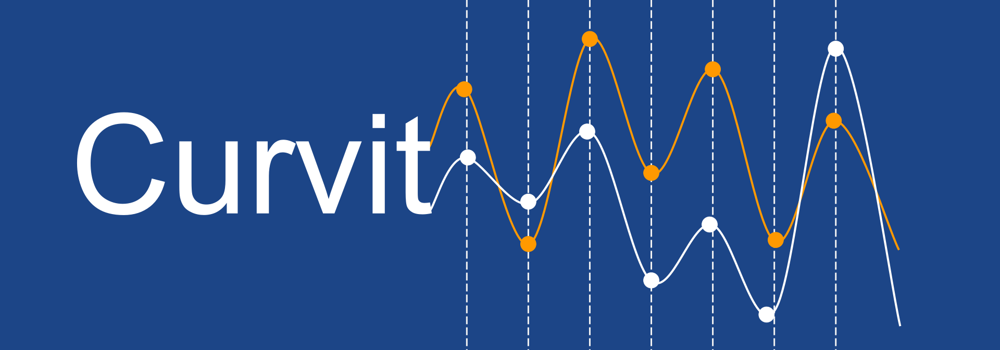

.. Curvit documentation master file, created by
   sphinx-quickstart on Thu Jun 24 20:03:46 2021.
   You can adapt this file completely to your liking, but it should at least
   contain the root `toctree` directive.

Welcome to Curvit's documentation!
This website will walk you through the steps of installing and getting
familiarized with Curvit and creating your own light curves using UVIT data. 

.. important::
    If you use Curvit for work presented in a publication or talk, please help 
    by providing :ref:`citation`. 
    
.. caution::
    The software is undergoing `active developement <https://github.com/prajwel/curvit>`_. 
    For new features and bug fixes, always refer the updated documentation 
    and check for upgrades using::
    
        pip install curvit --upgrade

.. toctree::
    :maxdepth: 1
    :caption: Contents:   

    preamble
    install
    getting_started
    citation
    api
    report_bugs
   

